# hse_hw1_meth

## [Colab](https://colab.research.google.com/drive/124uWf5F4w3LDTYR2owhtsqxD0teZtN3X?usp=sharing)

## Особенности секвенирования РНК по сравнению с ДНК

В первую очередь, что бросается в глаза -- так это крайне необычный вид графика GC-content -- он больше никаким образом не похож на график нормального распределения. Наблюдаются два пика на позициях приблизительно 22% и 70%. 

Также заметно отличие на графике Per base sequence content: много тимина и мало цитозина по сравнению с тем же графиком секвенированной ДНК более обычным образом.

Это может быть объяснено фактом бисульфитного секвенирования: при воздействии бисульфитом на ДНК, цитозин превращается в урацил, но не весь, ведь если цитозин метилирован, он не подвергается превращению. Но это ДНК, поэтому урацил считывается как тимин

## Число ридов, картированных на участки, и процент дупликации
Стадия развития |	Название |	Риды на участке 11347700-11367700 |	Риды на участке 40185800-40195800 | Процент дуплицирования 
-|-|-|-|-
8cell |	SRR5836473 |	1090 | 464 | 18.31% 
Epiblast |	SRR3824222 |	2328 |	1062 | 2.92% 
ICM |	SRR5836475|	1456 |	630 | 9.08% 

## M-Bias графики
8 cell |	Epiblast | ICM
-|-|-
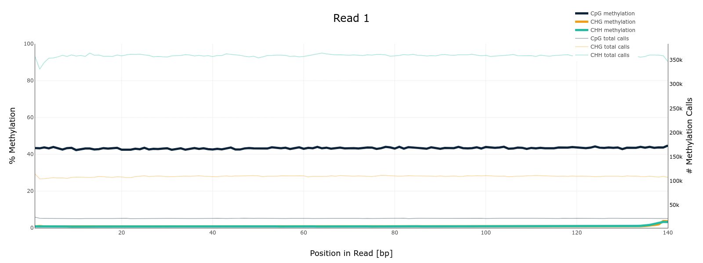 |	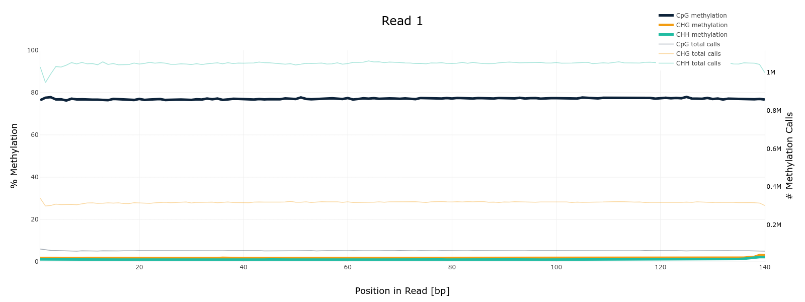 |	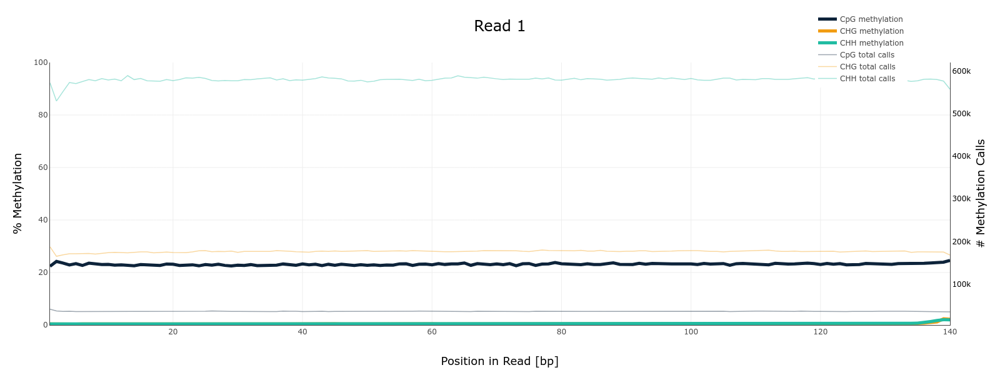
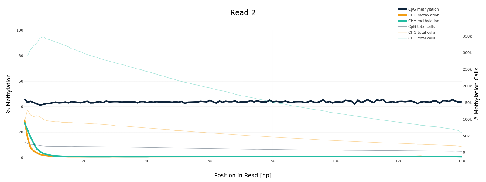 |	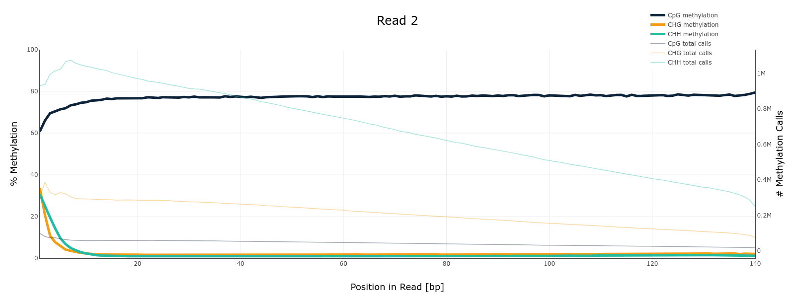 |	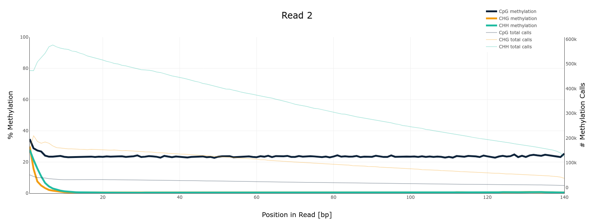

## Гистограммы распределения метилирования цитозинов по хромосоме
8 cell |	Epiblast | ICM
-|-|-
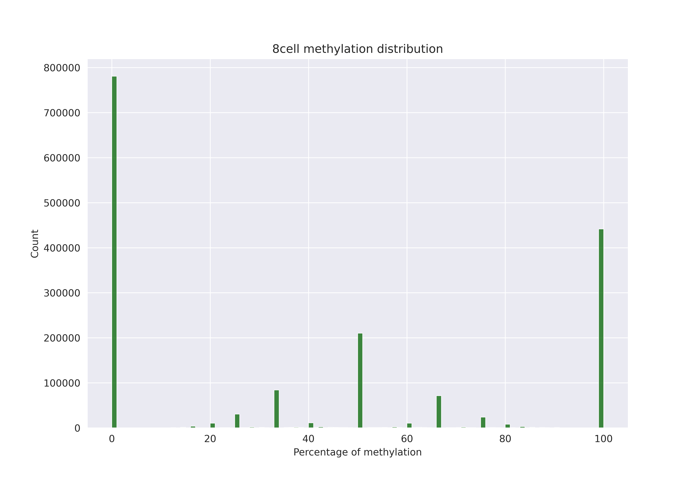 |	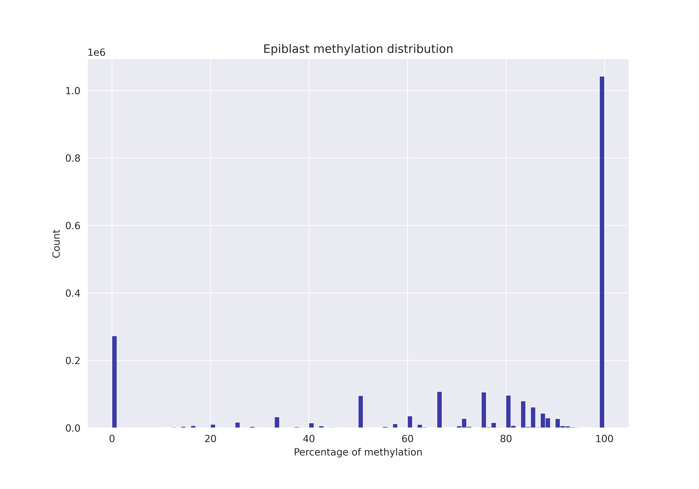 |	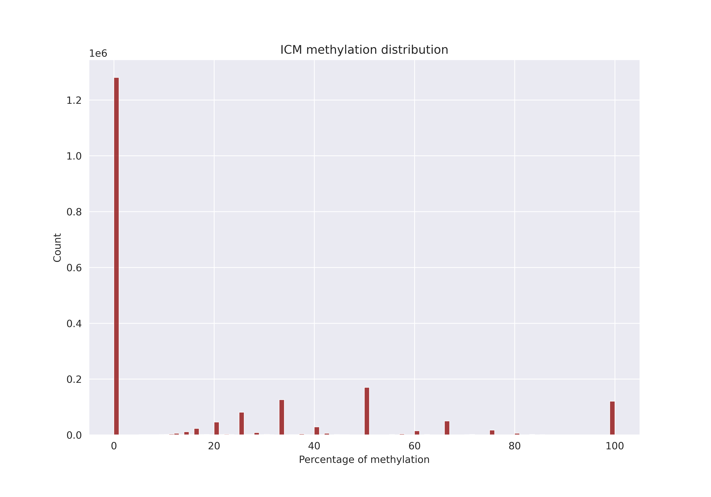

## Графики покрытия и метилирования
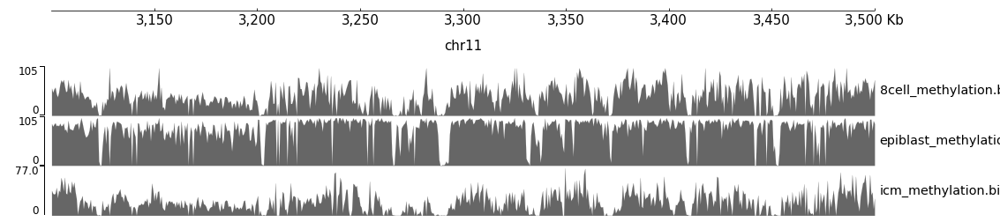

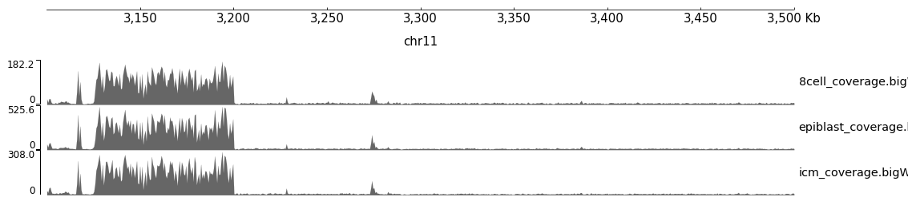
